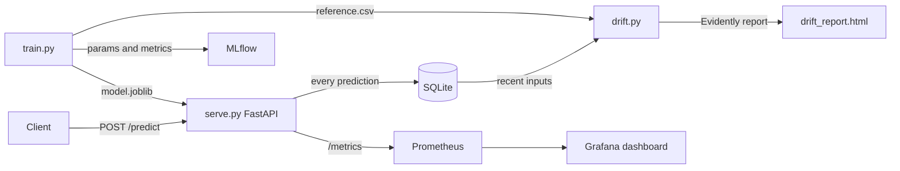

# MLOps Churn Prediction


**Live demo:** [API on Hugging Face Spaces](https://yliman-churn-prediction.hf.space/docs)

Predicts customer churn using XGBoost, with full MLOps tooling: experiment tracking via MLflow, data drift detection via Evidently, and automated CI/CD via GitHub Actions.

## How it works

A customer's account features go in, and the model outputs whether that customer is likely to churn along with a probability score. Every prediction is stored and monitored for drift over time.

## Architecture



## Tech Stack

| Layer | Technology |
|---|---|
| Language | Python 3.11 |
| Model | XGBoost Classifier |
| Experiment Tracking | MLflow |
| Drift Detection | Evidently AI |
| Service Monitoring | Prometheus + Grafana |
| API | FastAPI + Uvicorn |
| Containerization | Docker + Docker Compose |
| CI/CD | GitHub Actions |
| Testing | Pytest |

## Quick Start

**Install dependencies**

```bash
pip install -r requirements.txt
```

**Train the model**

```bash
python -m src.train
mlflow ui
```

Open http://localhost:5000 to browse experiments and compare runs.

**Manage model versions**

Each training run registers a new version of `churn-predictor` in the MLflow Model Registry. Promotion to a stage is a separate, deliberate step:

```bash
python -m src.registry list
python -m src.registry promote --version 3 --stage Production
```

By default the API serves the local model file so the Docker image stays self-contained. Set `USE_REGISTRY=true` to load the version tagged `production` from the registry instead; `GET /model-info` shows which source is active and all registered versions.

**Serve the API**

```bash
uvicorn src.serve:app --reload
```

**Check for data drift**

```bash
python -m src.drift
```

**Run with Docker Compose**

```bash
docker-compose up --build
```

| Service | URL |
|---|---|
| API | http://localhost:8000 |
| Swagger docs | http://localhost:8000/docs |
| MLflow UI | http://localhost:5000 |
| Prometheus | http://localhost:9090 |
| Grafana | http://localhost:3000 (admin / admin) |

## API Endpoints

| Method | Endpoint | Description |
|---|---|---|
| GET | `/health` | Readiness probe |
| GET | `/model-info` | Active model source and registered versions |
| GET | `/metrics` | Prometheus metrics (service + prediction) |
| POST | `/predict` | Predict churn for a customer |
| GET | `/logs` | Recent predictions |
| GET | `/stats` | Churn rate and counts |

**Example request:**

```bash
curl -X POST http://localhost:8000/predict \
  -H "Content-Type: application/json" \
  -d '{
    "tenure": 3,
    "monthly_charges": 99.0,
    "num_products": 1,
    "has_internet": 1,
    "contract_type": "month-to-month"
  }'
```

```json
{"churn": true, "probability": 0.8731}
```

## Running Tests

```bash
pytest tests/ -v
```

## CI/CD

Every push to `main` runs the test suite and then builds and smoke-tests the Docker image automatically.

## License

Released under the MIT License. See [LICENSE](LICENSE).
