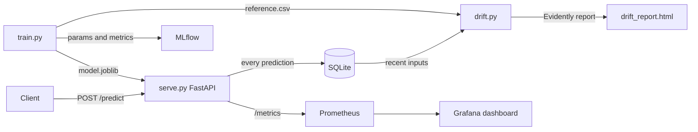

# MLOps Churn Prediction


**Run it yourself:** `docker compose up --build` starts the API, MLflow, Prometheus and Grafana together. See [Quick Start](#quick-start).

An XGBoost churn classifier with the serving stack around it: an MLflow registry where a new version is promoted by moving the `production` alias, Evidently drift checks, Prometheus metrics, and Kubernetes manifests with probes and an HPA. The other repos in this series reuse this pipeline on different problems; this is the one where every piece is built out.

## How it works

A customer's account features go in, and the model outputs whether that customer is likely to churn along with a probability score. Every prediction is stored and monitored for drift over time.

## Results

One seeded run of `python -m src.train` on the default settings (1,000 generated customers, 200 held out, XGBoost at `max_depth=4`, `n_estimators=100`):

| Metric | Value |
|---|---|
| ROC-AUC | 0.700 |
| F1 | 0.486 |
| Accuracy | 0.640 |
| Decision threshold | 0.12 |
| F1 at the default 0.5 cutoff | 0.130 |

**The threshold is the result here.** Only 23% of these customers churn and the generator rarely pushes a churn probability past 0.5, so a well-calibrated model asked to decide at 0.5 almost never says "churn". F1 collapses to 0.130 while ROC-AUC keeps insisting the ranking is fine. `choose_threshold()` picks the cutoff that maximises F1 on a third split held out from fitting, lands on 0.12, and lifts F1 to 0.486 (the same model, read at the right operating point). That threshold is saved next to the model in `model.joblib` rather than left for the caller to rediscover.

Accuracy drops to 0.640 as a direct consequence, below the 0.765 you would get by always answering "no churn". That is the intended trade: catching churners costs false positives, and on a retention problem a wasted discount is cheaper than a lost customer.

The data is synthetic and deliberately noisy, so a ROC-AUC of 0.700 is the ceiling the generator allows, not a benchmark against real customer data.

## Architecture



## Tech Stack

| Layer | Technology |
|---|---|
| Language | Python 3.11 |
| Model | XGBoost Classifier |
| Experiment Tracking | MLflow |
| Drift Detection | Evidently AI |
| Service Monitoring | Prometheus + Grafana |
| API | FastAPI + Uvicorn |
| Containerization | Docker + Docker Compose |
| Orchestration | Kubernetes |
| CI/CD | GitHub Actions |
| Testing | Pytest |

## Quick Start

**Install dependencies**

```bash
pip install -r requirements.txt
```

**Train the model**

```bash
python -m src.train
mlflow ui
```

Open http://localhost:5000 to browse experiments and compare runs.

**Manage model versions**

Each training run registers a new version of `churn-predictor` in the MLflow Model Registry. Promotion to a stage is a separate, deliberate step:

```bash
python -m src.registry list
python -m src.registry promote --version 3 --stage Production
```

By default the API serves the local model file so the Docker image stays self-contained. Set `USE_REGISTRY=true` to load the version tagged `production` from the registry instead; `GET /model-info` shows which source is active and all registered versions.

**Serve the API**

```bash
uvicorn src.serve:app --reload
```

**Check for data drift**

```bash
python -m src.drift
```

**Run with Docker Compose**

```bash
docker-compose up --build
```

| Service | URL |
|---|---|
| API | http://localhost:8000 |
| Swagger docs | http://localhost:8000/docs |
| MLflow UI | http://localhost:5000 |
| Prometheus | http://localhost:9090 |
| Grafana | http://localhost:3000 (admin / admin) |

## API Endpoints

| Method | Endpoint | Description |
|---|---|---|
| GET | `/health` | Readiness probe |
| GET | `/model-info` | Active model source and registered versions |
| GET | `/metrics` | Prometheus metrics (service + prediction) |
| POST | `/predict` | Predict churn for a customer |
| GET | `/logs` | Recent predictions |
| GET | `/stats` | Churn rate and counts |

**Example request:**

```bash
curl -X POST http://localhost:8000/predict \
  -H "Content-Type: application/json" \
  -d '{
    "tenure": 3,
    "monthly_charges": 99.0,
    "num_products": 1,
    "has_internet": 1,
    "contract_type": "month-to-month"
  }'
```

```json
{"churn": true, "probability": 0.8731}
```

## Kubernetes

`k8s/` has manifests for running the API on a cluster: a namespace, a `ConfigMap` for non-secret settings, a `Deployment` (2 replicas, resource requests/limits, liveness/readiness probes on `/health`, non-root security context), a `ClusterIP` `Service`, and an `HPA` (2-5 replicas on 70% CPU). They pull the public image from GHCR, so no registry credentials are needed.

Verified end-to-end on a local [kind](https://kind.sigs.k8s.io/) cluster: both replicas reached `Ready`, and `/health` and `/predict` responded correctly through the `Service`.

```bash
kubectl apply -f k8s/
kubectl get pods -n churn-prediction
kubectl port-forward -n churn-prediction svc/churn-api 8000:80
```

The `HPA` needs a metrics pipeline (e.g. `metrics-server`) to actually scale, which most managed clusters (EKS, GKE, AKS) provide by default; a plain `kind` cluster does not, so `kubectl get hpa` shows `<unknown>` for the CPU target locally.

## Deploying to Render

`render.yaml` defines the service as a Blueprint: Docker runtime, `/health` as the health check path, free plan. To deploy:

1. Sign in to [Render](https://render.com) with GitHub (no card required for the free plan).
2. **New** → **Blueprint**, select this repository. Render reads `render.yaml` and provisions the service automatically.

Render sets a `PORT` environment variable and expects the container to bind to it; the Dockerfile's `CMD` reads `${PORT:-8000}` so it works unmodified on Render, on Hugging Face Spaces, and locally.

## Running Tests

```bash
pytest tests/ -v
```

## CI/CD

Every push to `main` runs the test suite and then builds and smoke-tests the Docker image automatically.

## License

Released under the MIT License. See [LICENSE](LICENSE).
